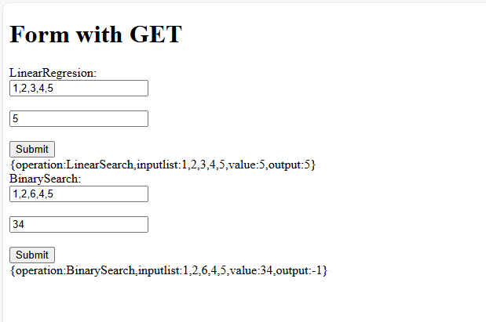
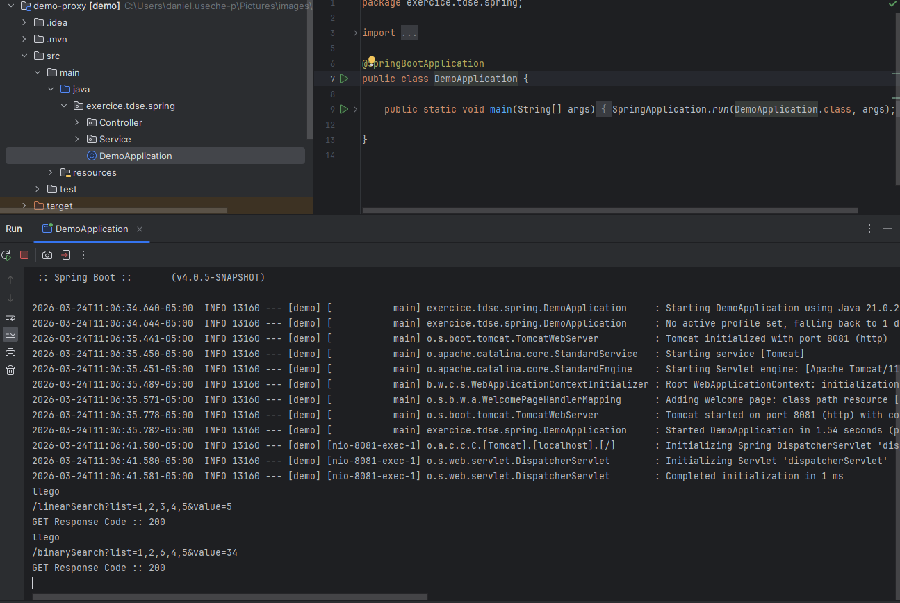
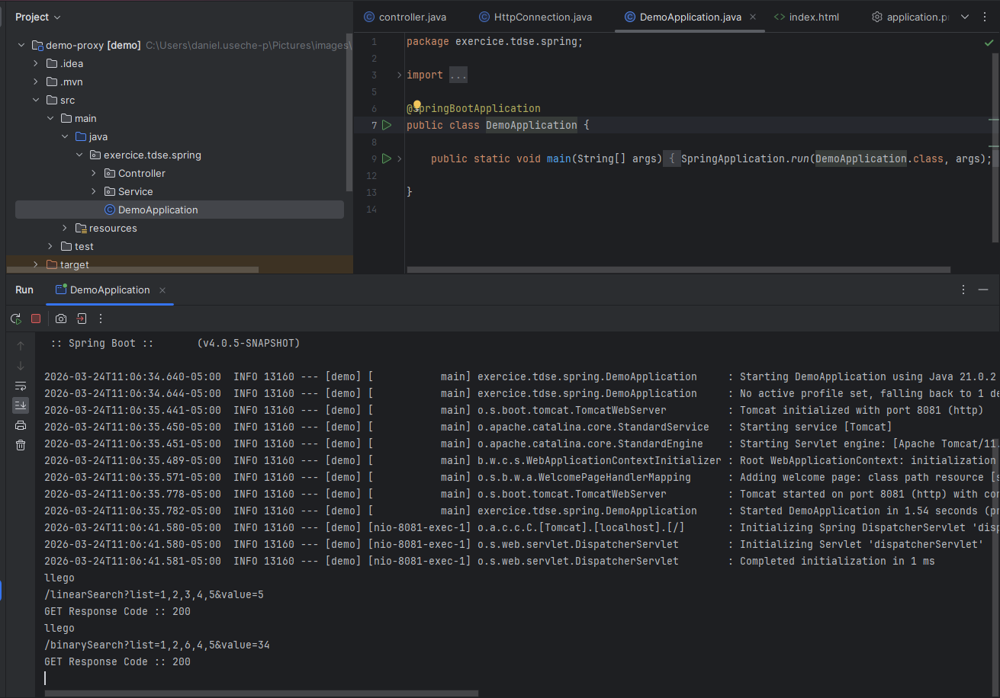
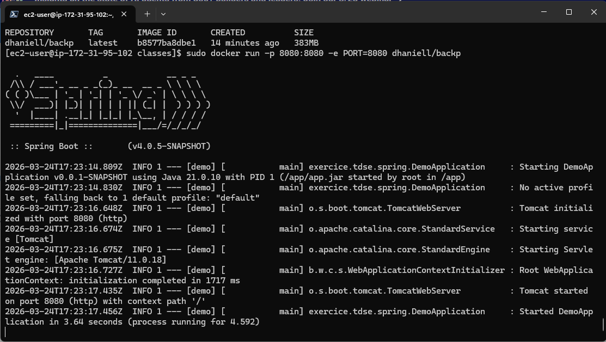
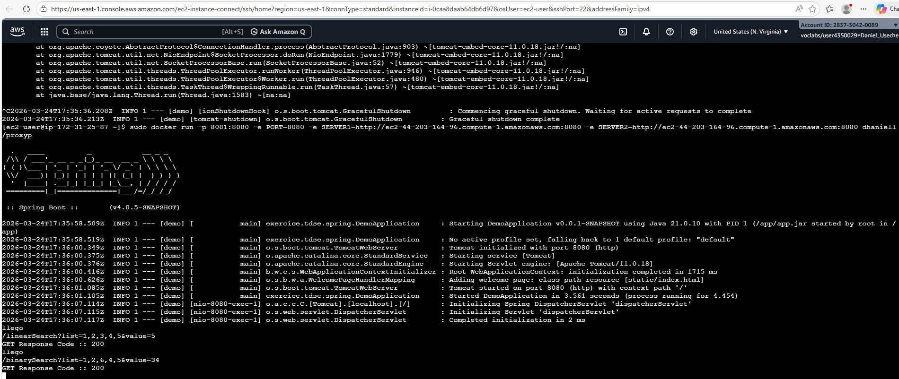
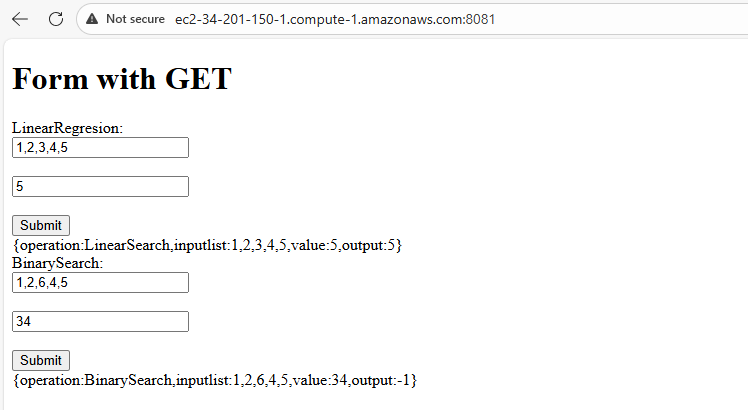

# Parcial TDSE
## estudiante: Daniel Eduardo Useche

es este parcial desarrolle la solucion del parcial en donde se despleg'o la solucion en tres EC2, en donde se expo un server proxy de acceso quien es el encargado de exponer el cliente desde donde el cual, se hacen las peticiones a las dos instacias del back, ¿Por que 3? dos instacias de back, por si una esta down (no agregue tildes porque el teclado no me lo permite)

subiendo back:

parcial-desplegado:

respuesta-proxy

link de vide:
https://pruebacorreoescuelaingeduco-my.sharepoint.com/:v:/g/personal/daniel_useche-p_mail_escuelaing_edu_co/IQCf8oOajvy9RYL6ZxBnsbCWAc_yWnNx3Rdf4HhtHA6Yb_M?nav=eyJyZWZlcnJhbEluZm8iOnsicmVmZXJyYWxBcHAiOiJPbmVEcml2ZUZvckJ1c2luZXNzIiwicmVmZXJyYWxBcHBQbGF0Zm9ybSI6IldlYiIsInJlZmVycmFsTW9kZSI6InZpZXciLCJyZWZlcnJhbFZpZXciOiJNeUZpbGVzTGlua0NvcHkifX0&e=IWK890